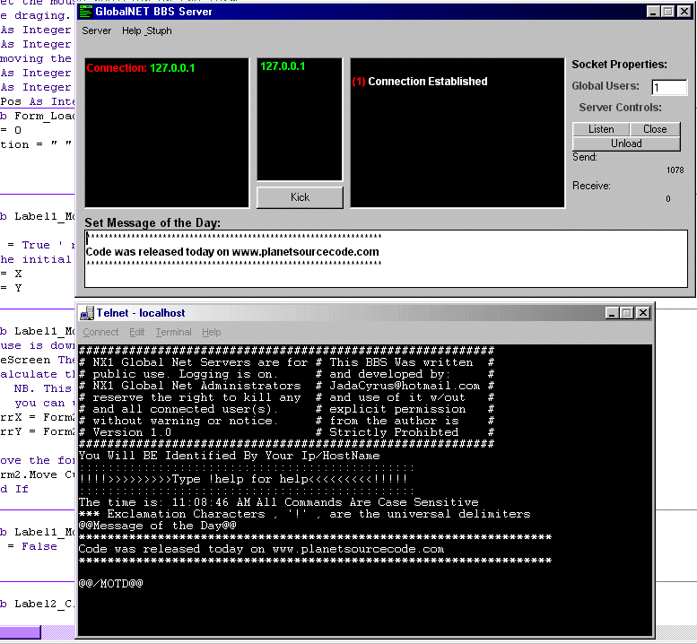



## Windows BBS Server \*FIXED\*

### Description

----

FIXED

----

-MINOR CODE ADJUSTMENTS-

-ADDEDD MISSING FILE: SoundModule.bas-

----

A fully functional Win32 Bit Bulletin Board System Server. It has all the essential and necessities. Multi-user of course and can handle as many connection as ur computer can take., It has MOTD and Announcement, a built in Message System and a finger service lookup. You can kick unruly users at ur wish. It traces all commands sent by users. You should create the folder: C:\Articles , or else it wont work. You can change the directory if you change all the code used with it. Authors Note: Im looking for some good programmers to help me out with the next version/entry.. contact: JadaCyrus@hotmail.com for more details.

-Well thats pretty much it-

-JadaCyrus-
 
### More Info
 
Create: C:\Articles

Do not Modify: poorbeep.wav

             |
---                |---
**Submitted On**   |2001-02-20 11:05:04
**By**             |[Alex](https://github.com/Planet-Source-Code/PSCIndex/blob/master/ByAuthor/alex.md)
**Level**          |Advanced
**User Rating**    |4.3 (13 globes from 3 users)
**Compatibility**  |VB 6\.0
**Category**       |[Complete Applications](https://github.com/Planet-Source-Code/PSCIndex/blob/master/ByCategory/complete-applications__1-27.md)
**World**          |[Visual Basic](https://github.com/Planet-Source-Code/PSCIndex/blob/master/ByWorld/visual-basic.md)
**Archive File**   |[CODE\_UPLOAD152432202001\.zip](https://github.com/Planet-Source-Code/alex-windows-bbs-server-fixed__1-15041/archive/master.zip)

